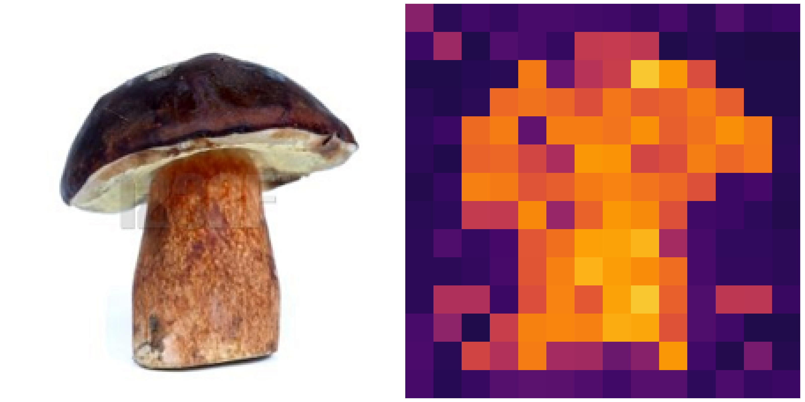
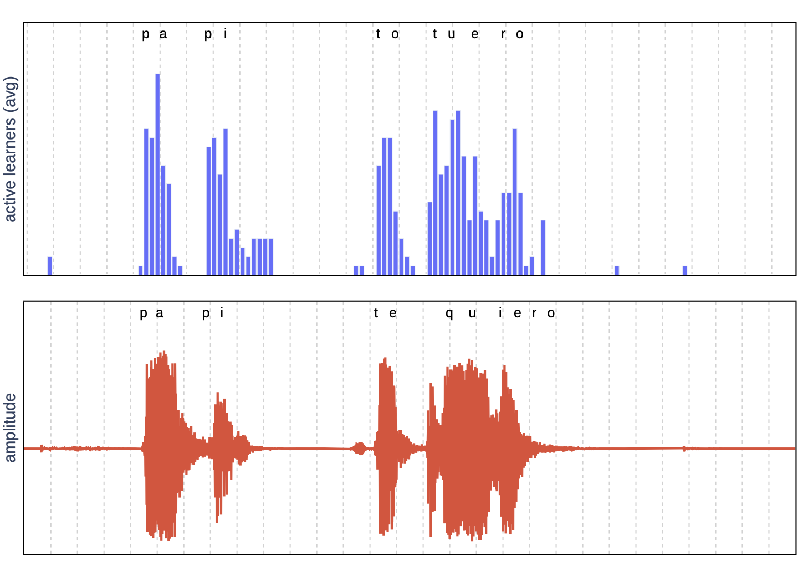

This brief post summarizes a project I have been working on over the past months. ou can find further details about this work [here](https://scholar.google.com/citations?view_op=view_citation&hl=it&user=er31rp0AAAAJ&citation_for_view=er31rp0AAAAJ:d1gkVwhDpl0C)

### We need faster transformers 

The computational cost of transformer models makes them inefficient in low-latency or low-power applications. Techniques such as quantization, distillation, sparsification, or linear attention can reduce the computational load, they may incur a reduction in accuracy. 

In addition, globally reducing the cost for all inputs may be sub-optimal. For each layer, the full width of the layer may be needed only for a small subset of tokens inside a batch and that the "effective" width needed to process a token can vary from layer to layer.

Motivated by this observation, we introduced the **Adaptive Computation Module (ACM)** , a *generic* module that dynamically adapts its computational load to match the estimated difficulty of the input on a per-token basis.

### What is an ACM 

An ACM consists of a sequence of *learners* that progressively refine the output of their preceding counterparts (see Image). An additional gating mechanism determines the optimal number of learners to execute for each token.

    

Given an input token $z$, an ACM is composed of a set of $N$ homogeneous modules, $$ s_n(z; \phi_{(n)}) $$ , $$ n \in \{1, ..., N\} $$, each module having weights $$ \phi_{(n)} $$. We refer to these modules as *learners*. The output of the ACM block is: 
$$ 
h(z, k; \phi) = \sum_{n=1}^k s_n(z; \phi_{(n)}) 
$$ 

A gating network selects $$ k $$, i.e. **how many learners to activate**, using Gumbel-Softmax trick. 

### Training

We use a distillation technique to replace any pre-trained model with an "ACMized" variant. The distillation phase is designed to be highly parallelizable across layers while being simple to plug-and-play into existing networks.

Before training, we substitute a subset of base model layers with ACMs of similar size. The training is composed of three steps. In the first step, ACMs are trained by distilling knowledge from replaced modules. Gating networks are then trained as a classification task using artificial labels derived from the distance to original outputs. In the third phase, we finetune the entire model end-to-end to allow it to adapt its weights to the dynamic inference setting. To make the model more predictable in terms of its computational cost, we add an auxiliary loss term that penalizes for any deviation from the given target budget.

### How well does it work ?

Our evaluation of transformer models in computer vision and speech recognition demonstrates that substituting layers with ACMs significantly reduces inference costs without degrading the downstream accuracy for a wide interval of user-defined budgets.

Here we show how each token is allocated an amount of rescources that aligns surprisingly well with its semantic meaning.

<table style="width:80%;  margin-left: auto; margin-right: auto;">
  <tr>
    <td style="width:49%">
      
      
      
    </td>
    <td>
      
      
    </td>
  </tr>
    <tr>
    <td style="width:49%">
        <b>Image classification:</b> For each image, we show a heatmap whose color is proportional to the amount of budget expended for that token.
    </td>
    <td>
        <b>Speech recognition:</b> Original waveform is on the bottom, while on top we show how much compute has been used for each time-instant.
    </td>
  </tr>
</table>

Here we report the performance compared to other strong baselines.

<table style="width:80%;  margin-left: auto; margin-right: auto;">
<tr>
    <td style="width:49%">
        <b>Image classification</b> 
    </td>
    <td>
        <b>Speech recognition</b> 
    </td>
</tr>
<tr>
    <td style="width:49%">
      
    </td>
    <td style="width:49%">
      
    </td>
</tr>
</table>

You can find further details about this work [here](https://scholar.google.com/citations?view_op=view_citation&hl=it&user=er31rp0AAAAJ&citation_for_view=er31rp0AAAAJ:d1gkVwhDpl0C)

### Reference
1. G. Aguilar, Y. Ling, Y. Zhang, B. Yao, X. Fan, and C. Guo. Knowledge distillation from internal representations. In Proceedings of the
AAAI Conference on Artificial Intelligence, volume 34, pages 7350–7357, 2020. 1
2. M. Courbariaux, Y. Bengio, and J.-P. David. Training deep neural networks with low precision multiplications. arXiv preprint
arXiv:1412.7024, 2014. 1
3. T. Dettmers, M. Lewis, Y. Belkada, and L. Zettlemoyer. Llm. int8 (): 8-bit matrix multiplication for transformers at scale. arXiv preprint
arXiv:2208.07339, 2022. 1
4. S. Han, J. Pool, J. Tran, and W. Dally. Learning both weights and connections for efficient neural network. Advances in neural information
processing systems, 28, 2015. 1
5. G. Hinton, O. Vinyals, and J. Dean. Distilling the knowledge in a neural network. arXiv preprint arXiv:1503.02531, 2015. 1
6. T. Hoefler, D. Alistarh, T. Ben-Nun, N. Dryden, and A. Peste. Sparsity in deep learning: Pruning and growth for efficient inference and
training in neural networks. The Journal of Machine Learning Research, 22(1):10882–11005, 2021. 1
7. Y. LeCun, J. Denker, and S. Solla. Optimal brain damage. Advances in neural information processing systems, 2, 1989. 1
8. M. Wołczyk, B. Wojcik, K. Bałazy, I. T. Podolak, J. Tabor, M. ´ Smieja, and T. Trzcinski. Zero time waste: Recycling predictions in early ´
exit neural networks. Advances in Neural Information Processing Systems, 34:2516–2528, 2021. 2
9. H. Wu, P. Judd, X. Zhang, M. Isaev, and P. Micikevicius. Integer quantization for deep learning inference: Principles and empirical
evaluation. arXiv preprint arXiv:2004.09602, 2020. 1
10. H. Yin, A. Vahdat, J. M. Alvarez, A. Mallya, J. Kautz, and P. Molchanov. A-vit: Adaptive tokens for efficient vision transformer. In Proceedings of the IEEE/CVF Conference on Computer Vision and Pattern Recognition, pages 10809–10818, 2022. Z. Zhang, Y. Lin, Z. Liu, P. Li,